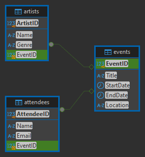
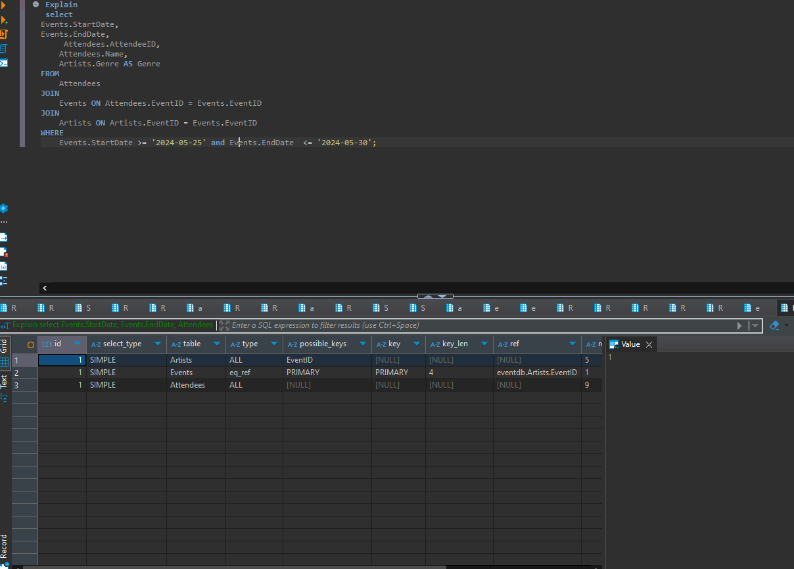

# Databas för Konserter 
## Mål: Betyg G

### KONSERT Event 
Den här databasen är skapad för att hantera konserter, deltagare och artister. Nedan finns detaljerade beskrivningar av tabeller, initialdata och SQL-frågor.
``` sql
-- Tabell för Events
CREATE TABLE Events (
    EventID INT PRIMARY KEY,
    Title VARCHAR(100),
    StartDate DATE,
    EndDate DATE,
    Location VARCHAR(255)
);
```
```sql
-- Tabell för Attendees
CREATE TABLE Attendees (
    AttendeeID INT PRIMARY KEY,
    Name NVARCHAR(50),
    Email NVARCHAR(100),
    EventID INT,
    FOREIGN KEY (EventID) REFERENCES Events(EventID)
);
```
```sql
-- Tabell för Artists
CREATE TABLE Artists (
    ArtistID INT PRIMARY KEY,
    Name NVARCHAR(100),
    Genre VARCHAR(100),
    EventID INT,
    FOREIGN KEY (EventID) REFERENCES Events(EventID)
);
```
## Databasuppsättningar för tabellerna
## Tabell : Events 
Den här tabellen innehåller information om titel på konserter, datum och plats.
```sql
INSERT INTO events (EventID, Title, StartDate, EndDate, Location)
VALUES
(1, 'ovo sound', '2024-05-22', '2024-05-23', 'Toronto'),
(2, 'Astroworld', '2024-05-24', '2024-05-25', 'Houston'),
(3, 'oblock', '2024-05-26', '2024-05-27', 'Chiraq'),
(7, 'weekday music', '2024-05-28', '2024-05-29', 'Vancovuer'),
(5, 'weekend music', '2024-05-30', '2024-05-31', 'Stockholm');
```
  ## Tabell: Attendees
Den här tabellen håller information om deltagare i olika konserter/Events.
``` sql

INSERT INTO Attendees (AttendeeID, Name, Email, EventID)
VALUES
(123, 'Omar Hassan', 'fttax@gmail.com', 2),
(126, 'Mateo Calderon', 'mateocalde@gmail.com', 3),
(129, 'Zlatan Ibra', 'zlatan@gmail.com', 1),
(145, 'Leo Messi', 'Messi@gmail.com', 7),
(135, 'Cristiano Ronaldo', 'cr@gmail.com', 5);
```
## Tabell: Artists
Den här tabellen beskriver artistens namn och Genre.

``` sql
INSERT INTO Artists (ArtistID, Name, Genre, EventID)
VALUES
(6, 'Drake', 'Rap', 1),
(666, 'Travis scott', 'Rap', 2),
(64, 'King Von', 'Rap', 3);
(23, 'The weekend', 'pop', 5);
(15, 'The weekday', 'rnb', 7);
```
## SQL-frågor för att hämta data
Hämta deltagare och deras evenemangsgenre
``` sql
SELECT
    Attendees.AttendeeID,
    Attendees.Name,
    Artists.Genre AS Genre
FROM
    Attendees
JOIN
    Artists ON Attendees.EventID = Artists.EventID;
``` 
## Hämta artister och deras evenemangsplatser
Denna fråga hämtar artister och platser för deras konserter

``` sql
SELECT
    Artists.ArtistID,
    Artists.Name,
    Events.Location
FROM
    Events
JOIN
    Artists ON Events.EventID = Artists.EventID
JOIN
    Attendees ON Events.EventID = Attendees.EventID;
```
## Procedurer för datainmatning
Skapa en procedur för att lägga till deltagare.
Proceduren AddAttendee säkerställer att en deltagare kan läggas till, men ignorerar om deltagaren redan är registrerad.
```sql
CREATE PROCEDURE AddAttendee (
    IN p_Name NVARCHAR(60),
    IN p_EventID INT,
    IN p_Email NVARCHAR(100),
    IN p_AttendeeID INT

)
BEGIN
    
    INSERT IGNORE INTO Attendees (Name, EventID, Email, AttendeeID)
    VALUES (p_Name, p_EventID, p_Email, p_AttendeeID);

    
    IF ROW_COUNT() > 0 THEN
        SELECT 'Deltagare har lagts till!' AS Message;
    ELSE
        SELECT 'Fel: Eventet existerar inte eller deltagaren är redan registrerad.' AS Message;
    END IF;
END
```


# Lägga till användare med begräsnad behörighet 

## skapa en begränsad användare
```sql
CREATE USER 'limited_user'@'localhost' IDENTIFIED BY 'your_password';
```

## GE anvädaren beränsad tillgång  
```sql
GRANT SELECT ON eventdb.Events TO 'llimited_user'@'localhost';
``` 

## Kontrollera att användaren har skapats rätt 
```sql  
SHOW GRANTS FOR 'limited_user'@'localhost';
```


# ER diagram 



## Prestanda analys 

Här är SELECT Frågan för att kunna optimeria prestandan på alla som kommer näravara på en konsert mellan 2024-05-25 och 2025-05-30
 
 ```sql
 Explain
 select 
Events.StartDate,
Events.EndDate, 
     Attendees.AttendeeID,
    Attendees.Name,
    Artists.Genre AS Genre
FROM
    Attendees
JOIN
    Events ON Attendees.EventID = Events.EventID
JOIN
    Artists ON Artists.EventID = Events.EventID
WHERE
    Events.StartDate >= '2024-05-25' and Events.EndDate  <= '2024-05-30';
```
    Resultatet blev inte som jag förväntade mig, det verkar inte som något optimeras och det verkar som att det finns för lite data i databasen för optimering.

 
 



# Backup och Restore 

## backup av databas via cmd 


## Hur man "restoerar" databasen mot en ny skapad databas 


